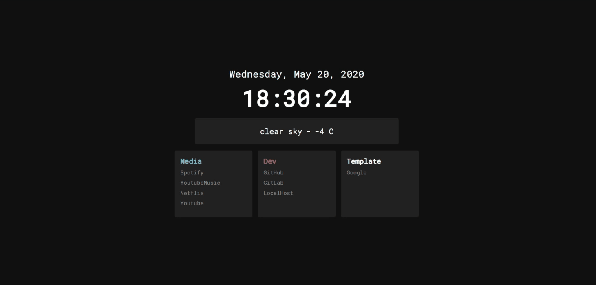

# Minimal-Dark-Homepage



## About
This project started off as a copy of [Jaredk3nt/homepage](https://github.com/Jaredk3nt/homepage), modified to my own personal preference. Then, heavily inspired by [deepjyoti30/startpage](https://github.com/deepjyoti30/startpage/), as a practice in TypeScript, and sheer boredom, this project is finally in its current form.

### Shoutout
The code for this project is modified heavily from:
- [Jaredk3nt/homepage](https://github.com/Jaredk3nt/homepage): Providing the base look of the page
- [deepjyoti30/startpage](https://github.com/deepjyoti30/startpage/): Providing the base for chrome extension

## Installation
You can install this both on Chrome and Firefox (requires [web-ext](https://github.com/mozilla/web-ext)).

### Chrome
- Get the latest release (zip) or clone this repo and extract it.
- Write the ```config.json``` for the configuration of the homepage, based on the template provided in  [sample_config.json](https://github.com/njhlai/homepage/blob/master/sample_config.json).
- Add an ```icon.png``` of your choice into ```img/```.
- Compile the TypeScripts in ```ts/``` by running
	```shell-script
		> cd ts/
		> tsc
	```
- On chrome, open extensions from the tool menu or open it from [chrome://extensions](chrome://extensions).
- Click on load unpacked, navigate to the directory where you cloned the repo and select it.

### Firefox
- Get the latest release (zip) or clone this repo and extract it.
- Write the ```config.json``` for the configuration of the homepage, based on the template provided in  [sample_config.json](https://github.com/njhlai/homepage/blob/master/sample_config.json).
- Add an ```icon.png``` of your choice into ```img/```.
- Compile the TypeScripts in ```ts/``` by running
	```shell-script
		> cd ts/
		> tsc
	```
- Build using ```web-ext```:
	```shell-script
		> web-ext build --ignore-files ts/ sample_config.json README.md
	```
	This will create a zip file in ```web-ext-artifacts/```.
- You can now load this by navigating to the [about:debugging](about:debugging), click on "This Firefox", click on "Load Temporary Add-on..." and select the zip file from the step before, in ```web-ext-artifacts/```. This will load the extension for the current session only.
- To have this more permenantly, you'll need to sign it using ```web-ext```. See [here](https://extensionworkshop.com/documentation/develop/getting-started-with-web-ext/#using-web-ext-section).

## Settings
Here is a guide to writing your own ```config.json```.

### username
Your display name. This is used in the search UI.

### squares
This is a list of ```square```, which is essentially a collection of links group by its title, which are of the form
```javascript
	{ 
		"title": /*title of square*/, 
		"color": /*hexcode of color of title*/, 
		"links": [/*list of links*/]
	}
```

### searchConf
This is a ```JSON``` of the form
```javascript
	{ 
		"enableSearch": /*boolean for search display*/, 
		"searchEngines": /*list of search engines, see [below](#searchengines)*/
	}
```

### searchEngines
A list of your search engines of choice. Each search engine item to be displayed in the search UI is of the form
```javascript
	{ 
		"engine": /*name of serach engine*/, 
		"query": /*query url*/
	}
```
The search querry will be appended to the end of query url during search. Pressing TAB will cycle through the search engines in this list.

### enableLocation
A ```boolean``` which indicates geolocation. No feature currently associated to this ```boolean```.

### timeConf
This is a ```JSON``` of the form
```javascript
	{ 
		"enableDate": /*boolean for date display*/, 
		"enableTime": /*boolean for time display*/, 
		"locale": /*string of date-time locale*/, 
		"options": /*Intl.dateTimeFormatOptions for additional options*/
	}
```

### weatherConf
This is a ```JSON``` of the form
```javascript
	{
		"enableWeather": /*boolean for weather display*/,
		"lat": /*string for lattitude*/,
		"lon": /*string for longtitude*/,
		"units": /*metric or imperial unit*/,
		"appid": /*appid of openweathermap.org*/
	}
```
